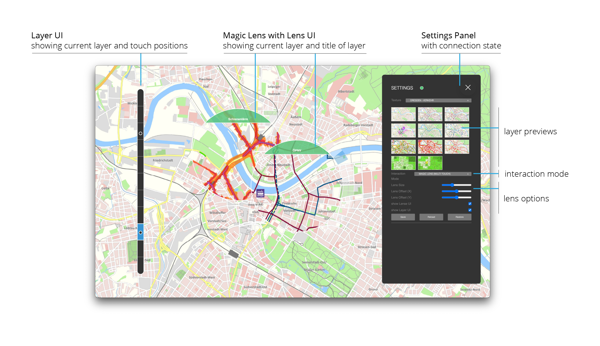
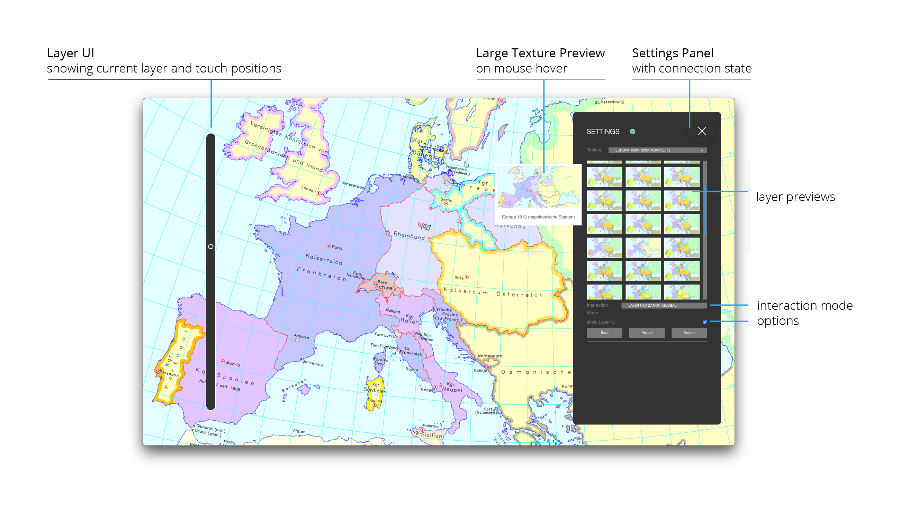
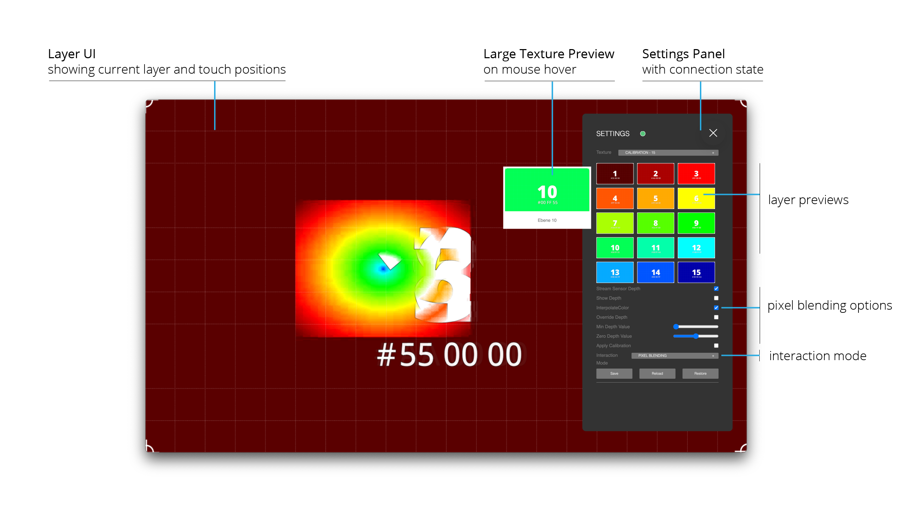

# ReFlex Layers

[![Angular Version][angular-shield]][angular-url]  
[![Tests][test-ci-shield]][test-ci-url]

Application for Layer-based Interaction on Elastic Displays using ReFlex Framework.

Demonstrates different approaches for exploring volumetric data, including spatial volume slices based on the deformation and multiple interactive lenses.

Contains basic sample data sets which can be modified to use the application with custom volumetric data, either based on image stacks or KTX Texture Arrays.

ReFlex Layers is an Angular-based web application that can be packaged as Electron desktop app (build commands for windows and mac are included) or deployed as Docker container.

<!-- omit in toc -->

## Table-of-contents

1. [Table-of-contents](#table-of-contents)
2. [User Interface](#user-interface)
3. [Textures](#textures)
4. [Example Data](#example-data)
5. [Generating KTX files](#generating-ktx-files)
6. [using Powershell scripts](#using-powershell-scripts)
7. [Sources for Additional Content](#sources-for-additional-content)
8. [Electron](#electron)
9. [Docker](#docker)
10. [Keyboard Shortcuts](#keyboard-shortcuts)
11. [Key Bindings for loading Datasets](#key-bindings-for-loading-datasets)
12. [Interaction Modes](#interaction-modes)
13. [Project Setup and Development](#project-setup-and-development)
14. [Known Issues](#known-issues)

## User Interface

The application features basically three visualization / interaction modes (see also [Interaction Modes](#interaction-modes)).

### Magic Lens (single touch and multi-touch)

Displays a lens containing the layer content of the depth of the deformation at the finger position.



Single Touch (only one lens for the finger causing the highest deformation) and Multi-Touch (one lens for each finger) modes can be selected separately.

Lens Options include the size of the lens, an optional offset from the finger and the specification whether additional information should be displayed on the lens itself.

### Layer Navigation

Displays the layer mapped to the current maximum deformation.



### Pixel Blending

Maps the depth information associated to each pixel on the surface to the displayed content by blending images based on the depth value.



Pixel Blending Options include developer / debugging options, whether to interpolate depth values for smoother blending and if the sensor calibration should be applied to the depth image.

## Textures

- Textures are specified in `/assets/data/data.json`
- Texture files need to be placed inside the `assets` folder as angular can only access files in this folder
- Textures are grouped into `TextureResources` which contain the data for a specific use case / scenario.

### Texture Formats

1. `Texture2D`
   - multiple images in common file formats (preferably `png` and `jpg`)
   - constraint: maximum 15 images can be used
2. `TextureArray`:
   - Number of images of equal size provided ina single file
   - either in RAW format (raw bit data) or in `Khronos KTX` texture format, could contain 256 or more images
3. `Texture3D`:
   - number of images of equal size, encoded as volumetric data structure
   - either in `DDS` format (raw bit data) or in `Khronos KTX` texture format
   - **REMARK:** currently not working / not implemented as `three.js` _can_ read and load DDS textures, but binding to a `Texture3d` is not working (it seems that three.js focuses on Texture Arrays)

### Common Properties for TextureResource

- `id`: unique identifier for loading the dataset
- `name`: displayed in the app
- `type`: specify Texture format:

  | value | associated format        |
  | ----- | ------------------------ |
  | 0     | Texture2d                |
  | 1     | TextureArray (KTX)       |
  | 2     | TextureArray (RAW Bytes) |
  | 3     | ~~Texture3D (DDS)~~      |
  | 4     | ~~Texture3D (KTX)~~      |

- `folder`: directory in which the files are stored, relative to `assets/data`
- `layers`: Array containing the description of the texture file

### Specific properties for TextureArrays

- `numLayers`: specifies how many textures are stored in the array
- `resX`: width of each texture in the array
- `resY`: height of each texture in the array
- `pixelFormat`: PixelFormat used by THREE.js to interpret the binary data (only needed for raw byte data)

  | value | associated pixel format |
  | ----- | ----------------------- |
  | 1024  | RGB                     |
  | 1028  | RedFormat               |

- layers should contain only a single texture

### App Configuration

There is an optional parameter `config` that can be set for each dataset. It specifies the default settings applied when loading the dataset:

```json

    "config": {
      // default interaction mode:
      //    0: Pixel Blending,
      //    1: Magic Lens (single touch)
      //    2: Magic Lens (multi touch)
      //    3: Layer Navigation
      "interaction": 1,
      "interpolateColor": true,
      // show layers and layer information at the lens
      "showLenseUI": true,
      // show position in the current layer on the side
      "showLayerUI": false,
      // selected mask for Magic Lens (only 3D Textures)
      "defaultLensMaskIdx": 1,
      // selected border color for Magic Lens (only 3D Textures) - RGBA (Hex)
      "lensBorderColor": "#ffff00",
      // scaling factor of lens
      "lensSize": 1.0,
      // horizontal lens offset from finger (Pixel)
      "lensOffsetX": 0.0,
      // vertical lens offset from finger (Pixel)
      "lensOffsetY": 0.0,
      // only for multi-touch Magic lenses: constrain number of available lenses
      "maxNumLenses": 1
    }
```

## Example Data

### Visible Human

- obtained from Visible Human project: [National Library of Medicine][nlm-url]

### CT Head Raw TextureArray

- obtained from [CodeProject article][ct-head]
- License: CPOL
- based on Three.js example:
  - [Demo][ct-head-demo]
  - [Code][ct-head-code]

## Generating KTX files

- Install Khronos Texture Tools from github:
- see documentation:
- for creating a layered texture with 10 images use:

```bash
    "C:\Program Files\KTX-Software\bin\toktx.exe" --t2 --encode etc1s --layers 10 output_texArray @files.txt
```

- creates a `output_texArray.ktx2` file containing the 10 images specified in `files.txt` in ktx2 format (switch `--t2`)
- encoding `etc1s` is mandatory, otherwise, the KTX Loader cannot read the file (`Unsupported vkFormat` or KTXLoader throws a transcoding error)
- **Remark**: texture files **MUST** have the resolution 1920 x 1080 pixel (if not, batch resizing using tools like [Microsoft PowerToys][powertoys-url] can help overcome this issue. Resizing in _kopaka1822/ImageViewer_ (see below) does not work, as the files cannot be transcoded properly afterwards)
- **Remark**: file paths in `files.txt` must be relative to the path from which the command is executed, alternatively, the prefix @@ can be used to specify file paths relative to `files.txt`
- **Remark**: currently `KTXLoader2` relies on a WASM transcoder, which needs to be configured at runtime (?). As workaround, the relevant code has been copied to `assets/jsm/`  
  See also:
  - [THREE.js docs][ktx-three-docs]
  - [github issue][ktx-three-issue]
- **Remark**: current version of KTX2Loader requires KTXTools Version **4.1** or higher (current release candidate: [Download][ktx-tools])
- **Remark**: There seem to be issues with the color space when using KTX textures. KTX uses linear sRGB color space, Three.js assumes sRGB color space. As a result, colors are way too dark when using KTX textures. Unfortunately, there is no way to specify the color space for the compressed texture. So, the only way is to convert colors in the shader. As utility functions for these operations seem to be broken in the current THREE.js version, manual conversion is necessary in the fragment shader:

```GLSL

  // conversion from Linear color space to sRGB
  vec4 fromLinear(vec4 linearRGB)
  {
    bvec4 cutoff = lessThan(linearRGB, vec4(0.0031308));
    vec4 higher = vec4(1.055)*pow(linearRGB, vec4(1.0/2.4)) - vec4(0.055);
    vec4 lower = linearRGB * vec4(12.92);

    return mix(higher, lower, cutoff);
  }

  // conversion from Linear color space to sRGB
  vec4 toLinear(vec4 sRGB)
  {
    bvec4 cutoff = lessThan(sRGB, vec4(0.04045));
    vec4 higher = pow((sRGB + vec4(0.055))/vec4(1.055), vec4(2.4));
    vec4 lower = sRGB/vec4(12.92);

    return mix(higher, lower, cutoff);
  }
```

- **Remark:** there is also a good texture viewer (including KTX textures), available at github: [kopaka1822/ImageViewer @ github][image-viewer-url]
- **Remark:** if the images contain an ICC profile, the KTX tool fails to create the TextureArray, as it cannot embed or covert ICC profile data. One workaround is to remove the ICC profile from the files. One tool which can be used for this is [PNGCrush][png-crush-url], using the command

  ```bash
    pngcrush_1_8_11_w64.exe -ow -rem allb -reduce file.png
  ```

  or in a batch file iterating over all pngs in a directory (Windows):

  ```bash
    For /R %%i in (*.png) do pngcrush_1_8_11_w64.exe -ow -rem allb -reduce %%i
  ```

## using Powershell scripts

There are two PowerShell scripts provided which automate the creation of the file list and creating the ktx command.

- to create the file list, run:

```PowerShell

  .\create-file-list.ps1 -Path "textures\" -Output "output.txt"

```

to create the file list with the following optional parameters:

- `Path` (default value: `"."`): the path to the texture directory **relative** script / current directory.

- `Output` (default value: `"files.txt"`): the name of the file in which the files will listed.

Both parameters are optional.

**Remarks**: Files are sorted by name (string sort)

- to create the KTX file, run:

```PowerShell

  .\create-ktx.ps1 -Path ".\test" -NumLayers 141 -ToolPath "C:\Program Files\KTX-Software\bin\toktx.exe"

```

with the following optional parameters:

- `ToolPath` (default value: "C:\Program Files\KTX-Software\bin\toktx.exe"): The path where the `toktx` tool is installed
- `Path` (default value: "."): The path to the directory with the files to be listed
- `Output`, (default value: "files.txt",): The name of the files list (must be located in $Path)
- `OutputFile`, (default value: "output_texArray"): The name of the output file
- `NumLayers`, (default value: 10): number of layers / textures in the file list

## Sources for Additional Content

| Additional Content                    | Link                                                   |
| ------------------------------------- | ------------------------------------------------------ |
| Dresden Hochwasser (2D/3D)            | [Dresden Hochwasser (arcGis)][dresden-arcgis]          |
| Dresden Themenstadtplan               | [Dresden Themenstadtplan (cardo.Map)][dresden-cardo]   |
| Historische Karten Europa 1500 - 2008 | [Digitaler Atlas zur Geschichte Europas][atlas-europa] |
| Visible Human Head                    | [National Library of Medicine][nlm-url]                |
| CT Head Raw                           | [CodeProject article][ct-head]                         |

## Electron

- application can be run as electron app using the command `npm run start:electron`
- application can be packaged as electron app using the command `npm run build:electron-win` or `npm run build:electron-mac`
- resulting electron files are stored in the `release` folder
- both commands start a production build before packaging
- **IMPORTANT:** Windows .exe files are limited to 2GB file size. As NSIS packages all resources into one large installer, this means that you have to be careful regarding the number of texture resources contained in the packaged installer.
  if the package is too large, the application is correctly built and copied to `win-unpacked` directory, but the installer file is corrupted and the build process fails with an error like this:

  ```bash
    File: failed creating mmap of "D:\Projekte\ReFlex\reflex-layers\reflex-layers\release\reflex-layers-0.9.0-x64.nsis.7z"
    Error in macro x64_app_files on macroline 1
    Error in macro compute_files_for_current_arch on macroline 7
    Error in macro extractEmbeddedAppPackage on macroline 8
    Error in macro installApplicationFiles on macroline 79
    !include: error in script: "installSection.nsh" on line 66
    Error in script "<stdin>" on line 189 -- aborting creation process
  ```

## Docker

- application can also be run a docker container
- start docker by `docker-compose -f docker/docker-compose.yml up --build` (add flag `-d` for detached run)
- asset directory `src/assets` is mounted as docker volume, so data changes in this path should be available in the containerized application

## Keyboard Shortcuts

The app starts in full screen mode. The following shortcuts are available:

| Shortcut               | Description                                                                                       |
| ---------------------- | ------------------------------------------------------------------------------------------------- |
| `S`                    | Toggle Settings Panel                                                                             |
| `Esc`                  | Close the application                                                                             |
| `STRG` + `Shift` + `I` | open dev tools                                                                                    |
| `STRG` + `R`           | reload app                                                                                        |
| `STRG` + `M`           | minimize app                                                                                      |
| `F1` - `F10`           | load specific Configurations (if defined, see [Key Bindings](#key-bindings-for-loading-datasets)) |

## Key Bindings for loading Datasets

It is possible to assign Keys to specific datasets. This can be done in the `assets/data/keybindings.json` file. So far, only assigning keys `F1` to `F10` has been tested; other might work as well.

Just add a (unique) mapping between key and dataset id in the form `{ "key": "F6", "dataset": 8 }` to the `keyBindings` array.

Example Config:

```json
{
  "keyBindings": [
    { "key": "F1", "dataset": 14 },
    { "key": "F2", "dataset": 51 },
    { "key": "F3", "dataset": 60 },
    { "key": "F4", "dataset": 4 },
    { "key": "F5", "dataset": 5 },
    { "key": "F6", "dataset": 8 },
    { "key": "F7", "dataset": 9 },
    { "key": "F8", "dataset": 15 },
    { "key": "F9", "dataset": 1 }
  ]
}
```

## Interaction Modes

### Pixel Blending

- Blends the image based on the color value from the depth sensor
- Options:
  - **Stream Sensor Depth**: Determine whether raw depth image is used for blending or greyscale representation of filtered PointCloud (_Default:_ **false**)
  - **Show Depth**: for debugging: show streamed depth image (_Default:_ **false**)
  - **Interpolate colors**: smooth depth image fpr reducing artefacts (_Default:_ **true**)
  - **Overrride Depth**: for debugging: manually set depth value (full screen) (_Default:_ **false**)
  - **Min Depth Value**: greyscale value mapped to deepest point (_Default:_ **0.0**)
  - **Zero Depth Value**: greyscale value mapped to zero plane point (_Default:_ **0.5**)
  - **Apply Calibration**: transform depth image based on the translate/scale values derived from the coordinate mapping between sensor and interaction space (_Default:_ **true**). If this is not set, depth image is stretched to fill the screen space

### Magic Lens (Single or Multi-Touch)

- Displays a lens at the finger position containing the content based on the deformation at the fingertip
- In Single-touch mode, the first touch is used to determine the lens position, in multi-touch mode, a lens for every finger is displayed
- Options:
  - **Lens Size**: Scaling factor for the lens (_Default:_ **1.0**)
  - **Lens Offset X**: move the lens from the fingertips in horizontal direction (_Default:_ **0.0**)
  - **Lens Offset Y**: move the lens from the fingertips in vertical direction (_Default:_ **0.0**)
  - **Show Lens UI**: show current layer at the border of the lens (_Default:_ **true**)
  - **Show Layer UI**: show layers and current position of the lenses at the side of the screen (_Default:_ **true**)

### Layer Navigation

- go through layers by deforming the screen, complete layer is displayed based on the deepest finger position
- Options:
  - **Show Layer UI**: show layers and current position at the side of the screen (_Default:_ **true**)

When using KTX-Arrays, **Lens Modes** offer an additional option to specify the lens mask. his can be customized to achieve effects such as a fisheye effect. Also, the border color of the lens can be specified.

## Project Setup and Development

This project was generated with [Angular CLI][angular-cli] version 21.2.12.

Run `npm install` in the root directory to install node packages.

### Code Scaffolding

Run `ng generate component component-name` to generate a new component. You can also use `ng generate directive|pipe|service|class|guard|interface|enum|module`.

### NPM Commands

| Command              | Description                                                          |
| -------------------- | -------------------------------------------------------------------- |
| `start`              | starts the Angular app on port 4302                                  |
| `start:electron`     | starts the app as packaged electron application                      |
| `watch`              | starts the Angular app on port 4302 in watch mode                    |
| `build`              | builds the Angular app                                               |
| `build:electron-win` | builds and packages the app as electron application (Target: Win)    |
| `build:electron-mac` | builds and packages the app as electron application (Mac OS - ARM64) |
| `test`               | executes unit tests via [Karma][karma-url]                           |
| `test-ci`            | executes unit tests via [Karma][karma-url] with headless browser     |

### Further Help

To get more help on the Angular CLI use `ng help` or go check out the [Angular CLI Overview and Command Reference][angular-cli] page.

## Known Issues

- current Electron version throw an error in the `KTX2Loader` responsible for loading KTX Textures. The error `Request is not defined` (in the implementation of the `load()` function) is thrown when loading textures (maybe due to a removed node package in Electron).
- on Windows, Electron fails to properly download binaries when using Node 24 or newer

<!-- MARKDOWN LINKS & IMAGES -->
<!-- https://www.markdownguide.org/basic-syntax/#reference-style-links -->

[angular-cli]: https://angular.io/cli

[angular-shield]: https://img.shields.io/badge/dynamic/json?color=brightgreen&label=angular&query=%24.dependencies[%27%40angular%2Fcore%27]&url=https%3A%2F%2Fraw.githubusercontent.com%2Fvisualengineers%2Fglyphspace%2Frefs%2Fheads%2Fmain%2Fpackage.json&style=for-the-badge
[angular-url]: https://angular.io/
[test-ci-shield]: https://github.com/visualengineers/reflex-layers/actions/workflows/test-ci.yml/badge.svg
[test-ci-url]: https://github.com/visualengineers/reflex-layers/actions/workflows/test-ci.yml
[atlas-europa]: https://www.atlas-europa.de/t01/territorien-staaten/t01-territorien-staaten.htm
[ct-head]: https://www.codeproject.com/Articles/352270/Getting-started-with-Volume-Rendering
[ct-head-demo]: https://threejs.org/examples/#webgl2_materials_texture2darray
[ct-head-code]: https://github.com/mrdoob/three.js/blob/master/examples/webgl2_materials_texture2darray.html
[dresden-arcgis]: https://www.arcgis.com/apps/webappviewer3d/index.html?id=7ab78747a18c4e3faca004dc39070958
[dresden-cardo]: https://stadtplan.dresden.de/?TH=UW_NO2_L
[image-viewer-url]: https://github.com/kopaka1822/ImageViewer
[karma-url]: https://karma-runner.github.io
[ktx-three-docs]: https://threejs.org/docs/index.html#examples/en/loaders/KTX2Loader
[ktx-three-issue]: https://github.com/mrdoob/three.js/pull/24946
[ktx-tools]: https://github.com/KhronosGroup/KTX-Software/releases/tag/v4.1.0-rc3
[nlm-url]: https://www.nlm.nih.gov/research/visible/visible_human.html
[png-crush-url]: https://pmt.sourceforge.io/pngcrush/
[powertoys-url]: https://github.com/microsoft/PowerToys
