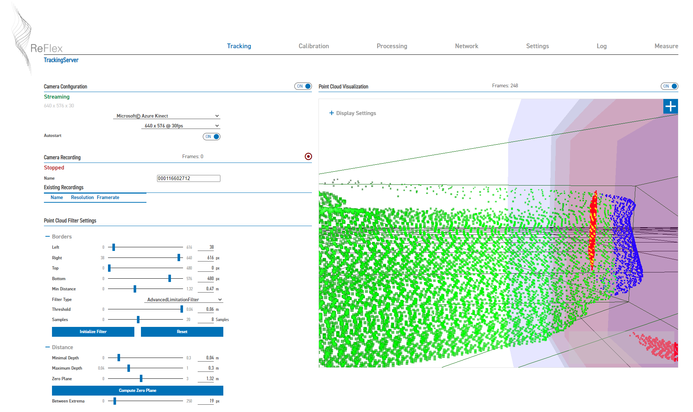
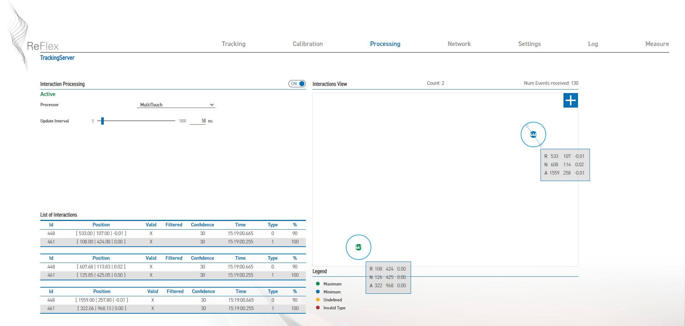
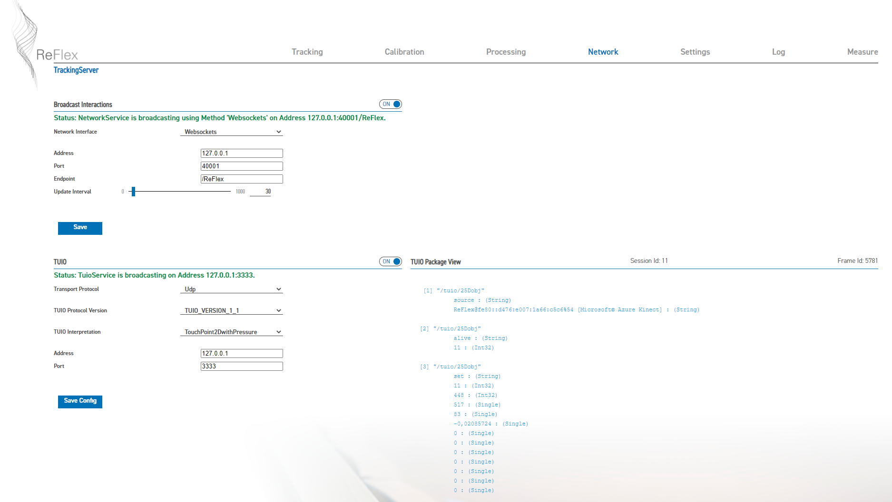
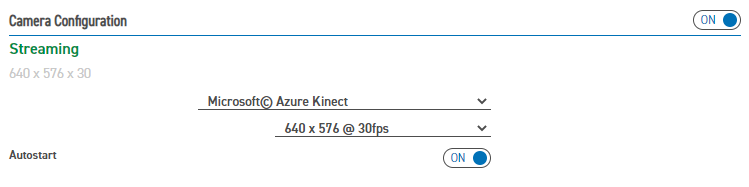
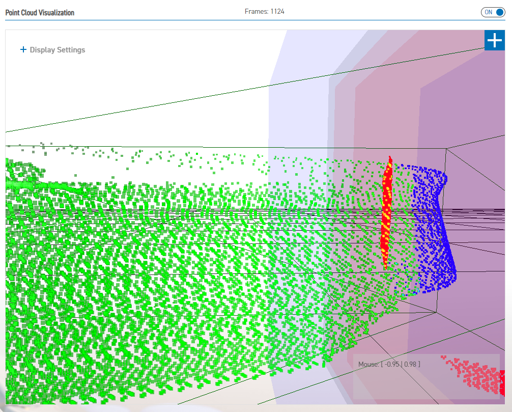
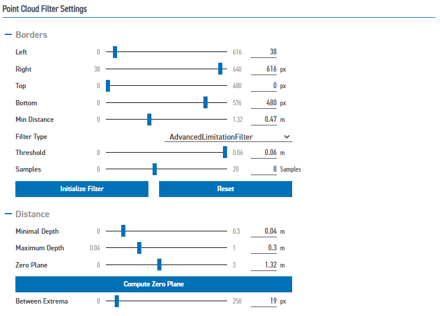
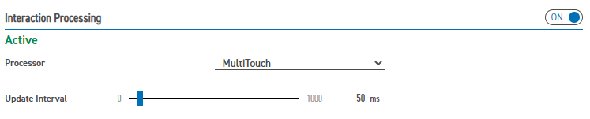
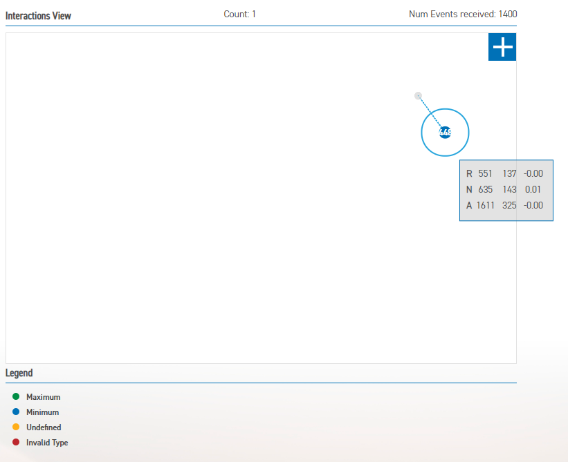
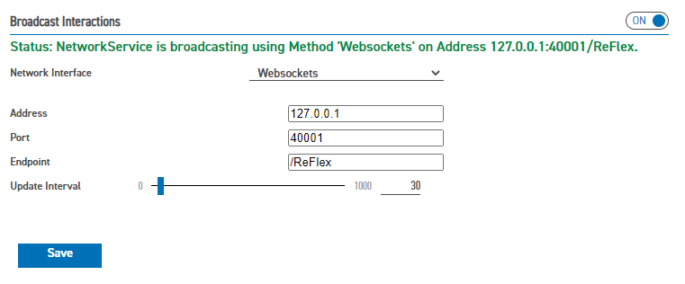
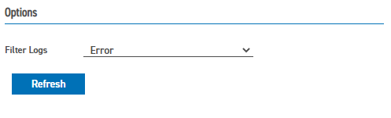

# Anleitung ReFlex Layers

<!-- omit in toc -->
## Inhalt

1. [Start der Anwendung](#start-der-anwendung)
2. [Shortcuts](#shortcuts)
3. [Fehlerbehebung](#fehlerbehebung)

## Start der Anwendung

1. __ReFlex TrackingServer__ starten
2. Einstellungen sollten automatisch beim programmstart geladen werden:
   1. Tab Tracking:

      

   1. Tab Processing:

      

   1. Tab Network:

      

3. ggf. Anwendung minimieren: `STRG` + `M`
4. __ReFlex Layers__ starten
5. ggf. `Settings` öffnen und gewünschte Visualisierung einstellen

## Shortcuts

  | Shortcut               | Description           |  
  | ---------------------- | --------------------- |
  | `S`                    | Settings ein/aus      |
  | `Esc`                  | Anwendung schließen   |
  | `STRG` + `Shift` + `I` | dev tools öffnen      |
  | `STRG` + `R`           | Anwendung neu laden   |
  | `STRG` + `M`           | Anwendung minimieren  |

## Fehlerbehebung

* prüfen, ob weiße LED an der Azure Kinect leuchtet
  * Falls nicht: Rechner / Anwendung neustarten
  * ggf. Kabel prüfen
  * `Azure Kinect Viewer` starten, schauen, ob die Kamera dort ein Tiefenbild liefert
* TrackingServer:
  * Tab `Tracking`:
    * prüfen, ob `Camera Configuration` __ON__, Kamera-Konfiguration prüfen
  
      
    * prüfen, ob Punktwolke (`Point Cloud Visualization` __ON__) empfangen wird und auch aktualisiert wird (Frames zählen, Punktwolke ändert sich)
  
      

    * Konfigurationswerte prüfen und ggf. justieren:
  
      

    * Kamera-Tracking ausschalten und wieder einschalten
  * Tab `Processing`:
    * prüfen, ob `Processing` __ON__, `Configuration` __Multi-Touch__
  
      

    * `Processing` ausschalten und wieder einschalten
    * prüfen, ob beim Verformen des Displays Interaktionen erkannt werden
  
      

      * falls nicht: Kamera Konfiguration / Kalibrierung
    * `Interaction Visualization` mittels Schaltfläche `+` auf Vollbild vergrößern, anbschließend prüfen, ob Position der Interaktrion auf die korrekte Position gemappt wird
      * falls nicht: Kamera Kalibrierung
  * Tab `Network`:
    * prüfen, ob `Networking` __ON__, `Network Interface` __Websockets__, Parameter prüfen
  
      
  * Tab `Log`:
    * nach `Error` filtern, schauen, welche Fehler aufgetreten sind
  
      

* ReFlex Layers:
  * `Settings` öffen
  * prüfen, ob Verbindungsstatus grün
  * andere Visualisierung (`Texture`) wählen und `Interaction Mode` wechseln
  * neu laden oder ggf Anwendugn komplett neu starten

* sofern Fehler durch obige Maßnahmen nicht behobenm werden kann:
  * Neustart beider Anwendungen
* wenn Einstellungen inkorrekt sind (z.B. Kalibrierung): Neu laden der Konfiguration:
  * Tab `Tracking`
  * Button `Load Config`
  * gewünschte Konfigurationsdatei laden
  * ggf. ist danach ein Neustart der Anwendungen notwendig